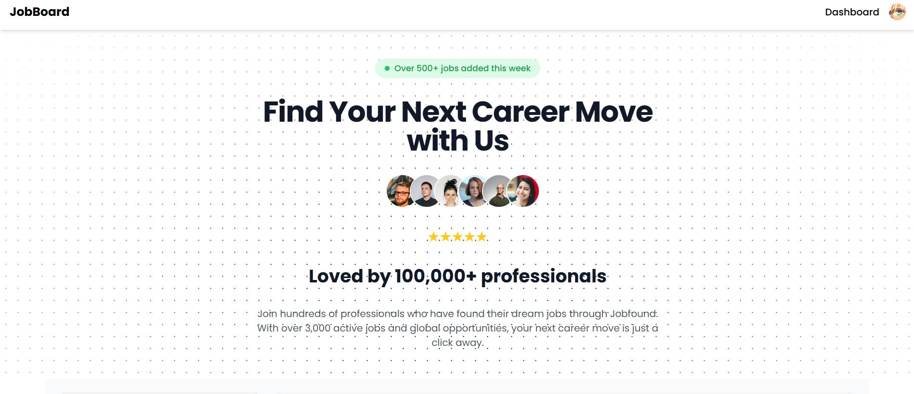
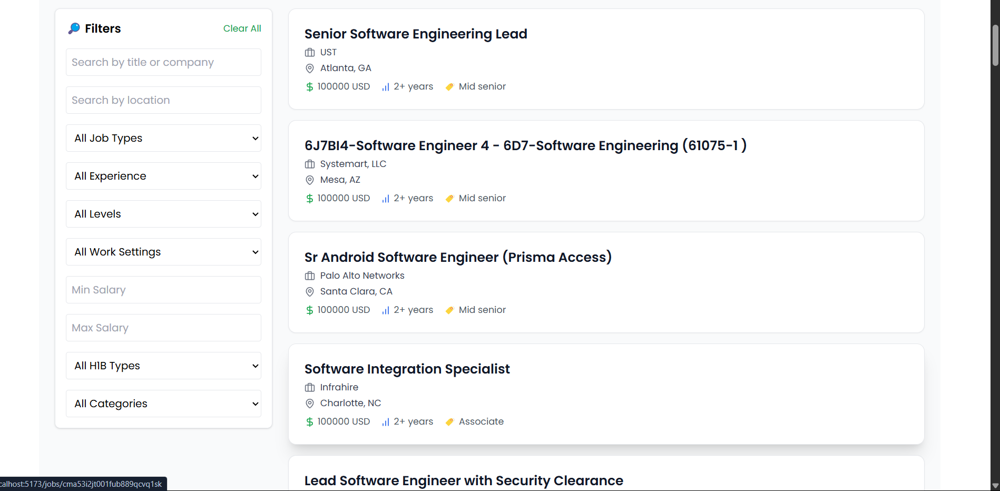
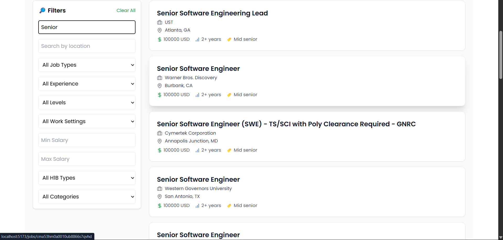
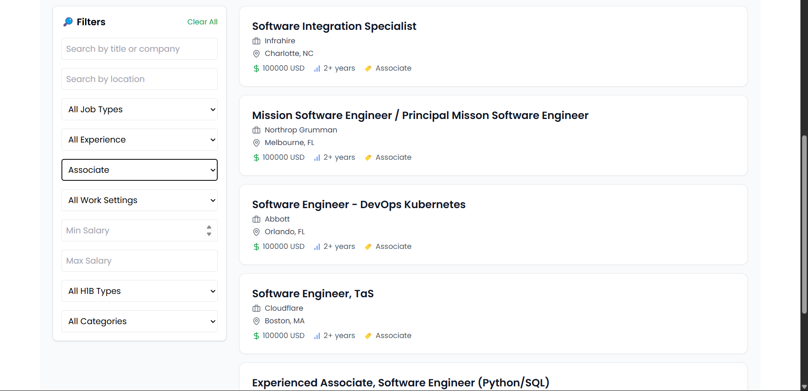
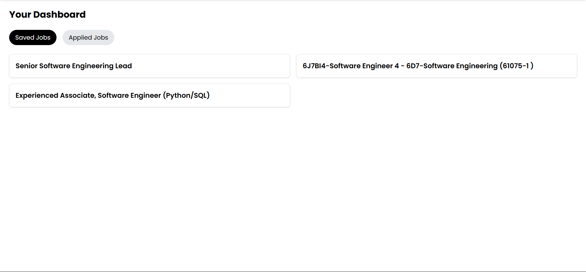
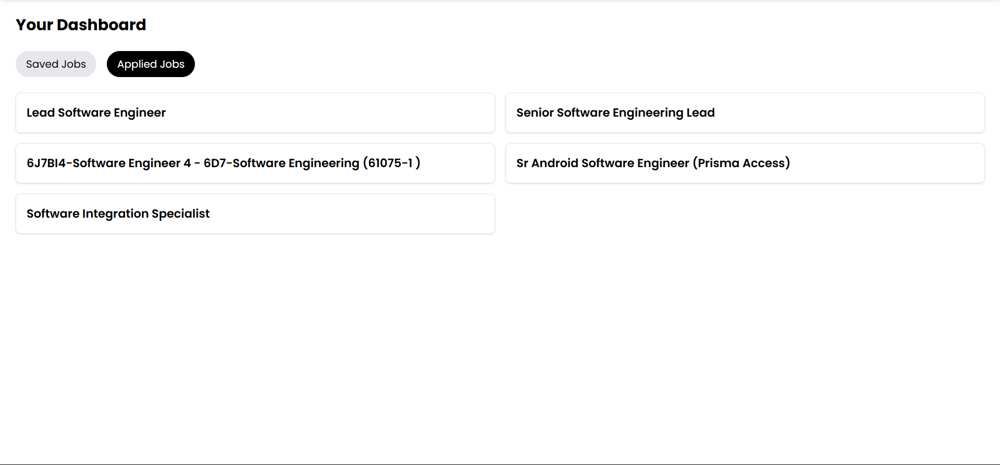
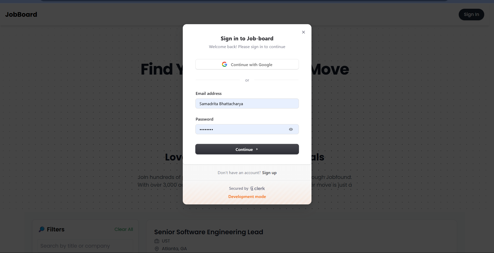

# Job Board App

A modern job board platform built with React, Express.js, PostgreSQL, and Prisma. Users can browse jobs, view detailed job listings, and save or apply for jobs. Authentication is handled using Clerk.

---

## 🧱 Tech Stack

### Frontend
- [Next.js](https://nextjs.org/) (TypeScript)
- [Tailwind CSS](https://tailwindcss.com/)
- [Shadcn UI](https://ui.shadcn.com/)
- [React Query](https://tanstack.com/query/latest)

### Backend
- [Node.js](https://nodejs.org/)
- [Express.js](https://expressjs.com/)
- [PostgreSQL + Supabase](https://supabase.com/)


## 🏗 Project Structure
```bash

│
├── client/          # React.js + Tailwind CSS 
│   └── src/    
│       └── src/    
│       └── components/    
│       └── lib/    
│       └── services/    
│       └── utils/    
│   
│
├── server/           # Node.js + Express.js APIs
│   └── src/        
│       └── config/        
│       └── controllers/        # API functions
│       └── routes/             # API endpoints
│       └── middlewares/        # API endpoints
│       └── index.js        # Main server file
│
└── docs/              # Readme
```

## 🔧 Installation & Setup
```bash
# Clone the repository
$ git clone https://github.com/ArnabhS/job-board.git
$ cd job-board
```
# Frontend Setup
```bash
$ cd client
$ npm install
$ npm run dev

# Runs on http://localhost:5173

# Create a .env.local file in root directory and add these vairables

VITE_CLERK_PUBLISHABLE_KEY = your_key
CLERK_SECRET_KEY = your_secret_key
VITE_BACKEND_URL = http://localhost:5000

```

# Backend Setup
```bash
$ cd server
$ npm install


# Create a .env file in root directory and add these vairables


PORT = 5000
CORS_ORIGIN = "http://localhost:5173"
DATABASE_URL= your_db_url
CLERK_PUBLISHABLE_KEY = your_key
CLERK_SECRET_KEY = your_secret_key


```
# Setup Database

```
cd server
npx prisma migrate dev --name init
npx prisma generate

```

## Run the server
```
$ npm run dev
# Runs on http://localhost:5000
```


### Features

-🧑‍💼 Clerk-based user authentication

-📄 Job listings with full detail view

-💾 Save or apply for jobs (user-specific)

-⚙️ REST API built with Express and Prisma

-📊 PostgreSQL as the database


### What I'd Do With More Time


-Integrate real-time notifications for job application updates
-Add resume upload and candidate profile sections
-Personalized Job listings according to users skills


## 📸 Project Preview

### Landing Page  


### Job Listing  


### Search Functionality 


### Filter Functionality 


### Saved Jobs 


### Applied Jobs


### Authentication with Clerk
